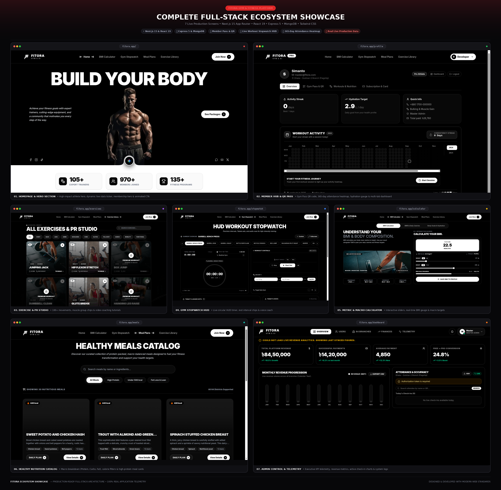

<div align="center">

# 🏋️‍♂️ FITORA — AI-Powered Realtime Fitness Ecosystem & Gym Management Platform

> **The Premier High-Performance Fitness Platform in Bangladesh**  
> Serving athletes, trainers, and administrators across all 64 districts with an ultra-luxury Pure Black & White visual identity, live workout tracking, contactless gym QR entry, and AI-assisted nutrition.

[](https://nextjs.org/)
[](https://react.dev/)
[](https://www.typescriptlang.org/)
[](https://expressjs.com/)
[](https://mongoosejs.com/)
[](https://tailwindcss.com/)
[](https://socket.io/)
[](LICENSE)

[🌐 **Live Production Application**](https://fitora-fitness.vercel.app) • [📖 **API Documentation**](server/README.md) • [🎨 **Frontend Guide**](client/README.md)

</div>

---

## 📑 Table of Contents

- [Overview & Vision](#-overview--vision)
- [🎨 Design System & Homepage Layout Reference](#-design-system--homepage-layout-reference)
- [✨ Key Platform Innovations](#-key-platform-innovations)
- [🔐 User Roles & Access Control Matrix](#-user-roles--access-control-matrix)
- [🌟 Core Modules & Application Features](#-core-modules--application-features)
- [💳 Subscription, Payment & Retention Engine](#-subscription-payment--retention-engine)
- [🏗️ Full-Stack Technology Architecture](#️-full-stack-technology-architecture)
- [📁 Repository Structure](#-repository-structure)
- [🚀 Getting Started & Installation](#-getting-started--installation)
- [⚙️ Environment Variables Configuration](#️-environment-variables-configuration)
- [🧪 Quality Assurance & Build Verification](#-quality-assurance--build-verification)
- [👥 Authors & Acknowledgments](#-authors--acknowledgments)
- [📄 License](#-license)

---

## 🎯 Overview & Vision

**Fitora** is an enterprise-grade, full-stack fitness and gym management platform engineered for modern athletes, fitness enthusiasts, and gym networks in Bangladesh. Built with **Next.js 16 (Turbopack)**, **Node.js/Express**, **MongoDB Atlas**, and **Socket.IO**, Fitora connects 64 nationwide branches into a unified digital ecosystem.

Unlike traditional gym software, Fitora combines:

1. **Athlete Telemetry**: Live biometric tracking, 365-day activity heatmaps, and rest interval HUDs.
2. **Contactless Access**: Instant QR-code-based digital membership passes for turnstile gym entry.
3. **Smart Retention & Commerce**: 3-Day Free Premium Trials, automatic card retention bonuses, vector PDF invoices, and multi-gateway payments (bKash, Nagad, Card, Stripe).
4. **Administrative Governance**: Admin-exclusive control center with branch occupancy telemetry, revenue analytics, and schema-enforced single Master Admin security.

---

## 🎨 Design System & Homepage Layout Reference

Fitora is designed with a **100% Monochromatic Pure Black & White (`#000000` / `#FFFFFF`) Luxury Aesthetic** inspired by brutalist minimalism and elite sports performance branding.

<div align="center">
  
</div>

### Visual Design Principles:

- **Monochrome High-Contrast**: Strictly `#000000` pitch black and `#FFFFFF` pure white, accented with subtle borders (`border-white/10` to `border-white/20`). Zero intrusive accent colors.
- **Signature Pill Button System**: Uniform `rounded-full` pill buttons paired with a circular rotating `ArrowUpRight` (`↗`) icon badge.
- **Responsive & Zoom-Proof Container**: Locked max-width container hierarchy (`max-w-7xl`) preventing UI distortion during 2K/4K scaling or browser zoom adjustments.
- **Strict Brand Identity**: 100% brand consistency standardized under **FITORA** / **FITORA GYM & AI**.

---

## ✨ Key Platform Innovations

### 1. 🏆 All-in-One Member Hub (`/profile`)

Replaces fragmented user pages with a unified 4-tab athlete cockpit:

- **Overview / My Fitness**: Live workout streak counter, daily hydration tracker, quick athlete profile details, dynamic 365-day attendance & workout `ActivityHeatmap`, and real-time BMI history table with one-click deletion.
- **Gym Pass & QR**: High-contrast digital membership card with a scannable QR code generated from `user.qrCodeId` for physical gym check-in.
- **Workouts & Nutrition**: Chronological workout logs (calories burned, duration), `PersonalizedNutritionPlan` matched to the athlete's goals, and scheduled `SavedMealPlan`.
- **Subscription & Card**: `MembershipStatusCard`, renewal modal, complete invoice history (`BillingSection`), and Saved Card Manager.

### 2. ⚡ 3-Day Free Premium Trial Engine

- Automatically initialized upon user registration (`trialExpiresAt = Date.now() + 3 days`).
- Displays a real-time animated countdown banner in the Member Hub (`d:h:m:s`).
- Allows new members to test all premium features before committing to a paid tier.

### 3. 💳 Save Card & 2 Bonus Months Retention Model

- Built-in customer retention engine: purchasing a monthly plan while saving a payment card automatically awards **90 days of access (1 month purchase + 2 bonus months FREE)**.
- Securely stores masked card metadata (`last4`, `brand`, `expiryMonth`, `expiryYear`, `cardHolder`) in MongoDB via dedicated `POST/DELETE /api/users/saved-card` routes.

### 4. 🛡️ Single Master Admin Schema Invariant

- Hardened at the Mongoose schema level (`User.model.ts`): only `master@fitora.com` can ever hold `role: "master_admin"`.
- Any attempt to register or elevate another account to `master_admin` is rejected with an explicit database error.

### 5. 🔒 Strict Admin-Only Dashboard Policy

- Access to `/dashboard` is strictly gated to `master_admin` and `branch_admin`.
- Free and premium athletes are automatically routed to their personalized Member Hub (`/profile`), keeping management analytics completely private.

### 6. 🔍 Dynamic Backend Search with Dedicated "Clear" Engine

- Replaced auto-filtering on keystroke with deliberate button-triggered search (clicking "Search" button or pressing `Enter`) across all management views.
- Dedicated "Clear" button resets input and immediately queries MongoDB directly, eliminating client-side memory filtering.

### 7. 📄 Portal-Mounted Single-Screen Invoice & Vector PDF Engine

- Built with React Portals (`createPortal`) mounting directly to `document.body` at `z-[99999]`, preventing stacking-context issues and overflow clipping.
- Compact single-screen layout fitting seamlessly on standard 1080p desktop displays without page scrolling.
- Pure vector PDF document generation via `jspdf` alongside browser-native print optimization (`@media print` in `globals.css`) with zero blank pages.

### 8. 🌐 100% Dynamic MongoDB Data Engine & Zero-Mock Guarantee

- Fully dynamic MongoDB persistence across all entities: exercises, healthy meals, workout logs, user goals, stopwatch presets, and transaction history.
- All hardcoded mock athletes, branches, and fallback financial figures have been completely eradicated, ensuring all data displayed originates directly from authentic MongoDB collections.

---

## 🔐 User Roles & Access Control Matrix

The platform enforces strict Role-Based Access Control (RBAC) across 5 distinct tiers:

| Route / Feature                              | Guest (Unauthenticated) |   Free Member    | Trial Member (3-Day Trial) | Premium Member (Pro/VIP) | Admin (`master` / `branch`) |
| :------------------------------------------- | :---------------------: | :--------------: | :------------------------: | :----------------------: | :-------------------------: |
| **Home Page (`/`)**                          |       ✅ Allowed        |    ✅ Allowed    |         ✅ Allowed         |        ✅ Allowed        |         ✅ Allowed          |
| **Login / Register (`/login`, `/register`)** |       ✅ Allowed        |   🔄 Redirect    |        🔄 Redirect         |       🔄 Redirect        |         🔄 Redirect         |
| **BMI Calculator (`/calculator`)**           |    🔒 Auth Required     |    ✅ Allowed    |         ✅ Allowed         |        ✅ Allowed        |         ✅ Allowed          |
| **Gym Rest Stopwatch HUD (`/stopwatch`)**    |    🔒 Auth Required     |    ✅ Allowed    |         ✅ Allowed         |        ✅ Allowed        |         ✅ Allowed          |
| **Exercise Catalog (`/exercises`)**          |    🔒 Auth Required     |  ✅ Basic Tier   |       ✅ Full Access       |      ✅ Full Access      |       ✅ Full Access        |
| **Healthy Meals Catalog (`/meals`)**         |    🔒 Auth Required     |    ✅ Allowed    |         ✅ Allowed         |        ✅ Allowed        |         ✅ Allowed          |
| **Member Hub (`/profile`)**                  |    🔒 Auth Required     | ✅ 4-Tab Cockpit |  ✅ 4-Tab (Active Trial)   |   ✅ 4-Tab (PRO Badge)   |         ✅ Allowed          |
| **Contactless Gym Pass QR (`/profile`)**     |    🔒 Auth Required     |    ✅ Allowed    |         ✅ Allowed         |        ✅ Allowed        |         ✅ Allowed          |
| **Admin Dashboard (`/dashboard`)**           |    🔒 Auth Required     |    🚫 Blocked    |         🚫 Blocked         |        🚫 Blocked        |     ✅ Exclusive Access     |

---

## 🌟 Core Modules & Application Features

### 🏋️ Front-Facing & Public Experience

- **Hero Section (`HeroSection.tsx`)**: Title Case Serif Italic _"Build Your Body"_ headline, transparent athlete cutout (`/hero.png`), non-clipped SVG bottom notch, left details text, social icons, right _"See Packages"_ button, and 3-column animated stats counter strip.
- **Why Choose Us (`WhyChooseUs.tsx`)**: High-contrast white container, 3 stacked workout images, feature checklist, and signature _"Free Trial Today"_ button.
- **Membership Pricing Section (`PricingSection.tsx`)**: 3-card membership showcase (Basic Pass, Pro Athlete, VIP Ultimate), Monthly / Annual toggle (Save 20%), and signature CTA buttons.
- **Trainer Callout Banner (`TrainerCalloutBanner.tsx`)**: Pitch-black callout banner _"Need a Fitness Trainer?"_, contact hotline, and signature _"PURCHASE NOW"_ button.
- **Consultation Form (`ContactInfoForm.tsx`)**: Consultation inquiry form, head office details (`Fitora Tower, Gulshan-2, Dhaka 1212` & `64 Branches in Bangladesh`), and signature _"SUBMIT NOW"_ button.
- **Global Header & Navigation (`Navbar.tsx`)**: Desktop centered nav links, mobile slide-in drawer, active route indicators, real-time unread notification bell, and dynamic `PRO` badge synchronization.
- **Global Footer (`Footer.tsx`)**: Bold _"GO FOR IT!"_ headline, location details, newsletter subscription, and developer credits.

### 📊 Health, Telemetry & Workout Tools

- **Metric & BMI Calculator (`/calculator`)**: Interactive height/weight adjustment sliders, real-time BMI score, BMR & TDEE macro calculation, and direct profile synchronization.
- **Real-Time Gym Rest Timer HUD (`/stopwatch`)**: Fullscreen distraction-free timer with quick rest preset chips (+30s, +60s), exercise selector, audio alerts, and telemetry logging to MongoDB.
- **Exercise Library & Tracker (`/exercises`)**: Live exercises loaded from MongoDB with category filters, muscle group tags, video instruction links, and VIP locks.
- **Healthy Meals & Diet Planner (`/meals`)**: Filterable recipe catalog with calorie tags, macro breakdowns, and one-click additions to the user's daily meal plan.

### 🛡️ Administrative Operations (`/dashboard`)

- **Platform Overview**: Live KPI metric cards (Total Revenue, Active Members, Check-ins Today, Branch Occupancy).
- **User Management Table**: Dynamic MongoDB regex search, role filter, branch filter, and member status controls.
- **Branch Directory**: Nationwide management covering all 64 districts in Bangladesh with real-time check-in counts.

---

## 💳 Subscription, Payment & Retention Engine

Fitora incorporates a secure, server-authoritative billing engine:

- **Server-Authoritative Pricing**: All tier pricing (`Basic Pass`, `Pro Athlete`, `VIP Ultimate`) is validated and calculated on the server. Client-submitted prices are rejected.
- **Supported Payment Gateways**: Simulated and direct integration with **bKash**, **Nagad**, **Card (Visa/Mastercard)**, and **Stripe**.
- **1-Click Dynamic Renewal**: Extending an active subscription automatically adds duration (30 days for monthly, 365 days for annual) onto the athlete's future expiration date, preventing any loss of remaining days.
- **Pure Vector PDF & Printable Invoices**: Generates cryptographic invoice serials (`INV-YYYY-XXXXXX`), transaction IDs, tax line-items, and instant high-resolution vector PDF export via `jspdf`.
- **Live Membership Tickers**: Real-time ticker counting down days, hours, minutes, and seconds remaining across the Member Hub.

---

## 🏗️ Full-Stack Technology Architecture

### Frontend Architecture (`client/`)

- **Framework**: Next.js 16 (App Router, Turbopack)
- **Language**: TypeScript 5.5
- **Styling**: Tailwind CSS v4, HeroUI, Framer Motion
- **Icons**: Lucide React, React Icons
- **PDF Engine**: `jspdf`
- **Notifications**: React Hot Toast
- **State Management**: React Hooks & Context (`useDashboardRole`, `useSession`, `useSyncExternalStore`)
- **Realtime**: Socket.IO Client

### Backend Architecture (`server/`)

- **Runtime**: Node.js 18+ & Express.js 4.19
- **Language**: TypeScript (`tsx` runtime engine)
- **Database**: MongoDB Atlas with Mongoose ODM
- **Realtime**: Socket.IO Server
- **Security**: JWT Authentication, CORS, Dotenv, Bcrypt.js
- **Services**: Modular business logic services (`payment.service.ts`, `calorieEstimation.service.ts`, `ai.service.ts`)

---

## 📁 Repository Structure

```
Fitora/
├── client/                                 # Next.js 16 Frontend Application
│   ├── public/                             # Static public assets (hero.png, logo.svg, images)
│   ├── src/
│   │   ├── app/                            # App Router Pages & Layouts
│   │   │   ├── (main)/                     # Main homepage ((main)/page.tsx)
│   │   │   ├── calculator/                 # BMI & Health Calculator page
│   │   │   ├── dashboard/                  # Admin-only dashboard portal
│   │   │   ├── exercises/                  # Exercise catalog & tracker page
│   │   │   ├── login/                      # User authentication login
│   │   │   ├── meals/                      # Healthy nutrition & meal planner
│   │   │   ├── payment/success/            # Payment confirmation landing page
│   │   │   ├── profile/                    # All-in-One Member Hub (4 tabs)
│   │   │   ├── profile/edit/               # User profile edit page
│   │   │   ├── register/                   # User registration (3-day trial trigger)
│   │   │   └── stopwatch/                  # Fullscreen gym timer HUD
│   │   ├── components/                     # Domain-Organized UI Components
│   │   │   ├── auth/                       # Login & register containers
│   │   │   ├── calculator/                 # BmiCalculator, MacroAdjuster, Assessment cards
│   │   │   ├── dashboard/                  # User management, Branch views, KPI stats
│   │   │   ├── exercises/                  # ExerciseTracker & workout catalog components
│   │   │   ├── home/                       # Hero, WhyChooseUs, Pricing, Callout, Contact
│   │   │   ├── invoice/                    # Vector PDF & print InvoiceModal
│   │   │   ├── meals/                      # MealCard & meal filter components
│   │   │   ├── notifications/              # NotificationBell & alert popups
│   │   │   ├── profile/                    # ActivityHeatmap, BillingSection, NutritionPlan
│   │   │   ├── subscription/               # MembershipStatusCard, CountdownTimer
│   │   │   ├── time/                       # GymTimer, ExerciseStopwatch, TimerControls
│   │   │   ├── Navbar.tsx                  # Global navigation bar & drawer
│   │   │   └── Footer.tsx                  # Global footer component
│   │   ├── data/                           # Fallback catalog data (MealsData.ts)
│   │   ├── hooks/                          # Custom React hooks (useDashboardRole)
│   │   ├── lib/                            # Auth client & membership utilities
│   │   ├── services/                       # Client REST API connectors
│   │   └── types/                          # Centralized TypeScript interfaces
│   ├── next.config.ts                      # Next.js configuration
│   ├── package.json                        # Frontend dependencies & scripts
│   └── tsconfig.json                       # Frontend TypeScript configuration
│
├── server/                                 # Express.js & Socket.IO Backend Server
│   ├── src/
│   │   ├── config/                         # Database & environment configurations
│   │   ├── controllers/                    # Route controller handlers
│   │   │   ├── auth.controller.ts          # Auth, login, registration, 3-day trial initialization
│   │   │   ├── branch.controller.ts        # 64 branch management & attendance check-ins
│   │   │   ├── exercise.controller.ts      # Exercise queries & muscle filtering
│   │   │   ├── master.controller.ts        # Master Admin platform oversight & analytics
│   │   │   ├── meal.controller.ts          # Healthy meals catalog & search
│   │   │   ├── notification.controller.ts  # Notification center CRUD & unread counter
│   │   │   ├── payment.controller.ts       # Checkout, Stripe, bKash, renewal extension
│   │   │   ├── stopwatch.controller.ts     # Gym timer telemetry & rest presets
│   │   │   ├── user.controller.ts          # User management, activity streaks, saved cards
│   │   │   └── workout.controller.ts       # Workout plans & logging
│   │   ├── middlewares/                    # Security & authentication middlewares
│   │   │   ├── auth.middleware.ts          # JWT verification & payload extraction
│   │   │   └── premium.middleware.ts       # Pro / VIP tier gate with admin overrides
│   │   ├── models/                         # Mongoose Database Schemas
│   │   │   ├── Branch.model.ts             # 64 branches in Bangladesh
│   │   │   ├── BranchCheckin.model.ts      # Turnstile check-ins & QR scans
│   │   │   ├── Exercise.model.ts           # Exercise definitions & guides
│   │   │   ├── Meal.model.ts               # Nutrition recipe items
│   │   │   ├── Notification.model.ts       # System & payment notifications
│   │   │   ├── Payment.model.ts            # Completed transactions & invoices
│   │   │   ├── StopwatchSession.model.ts   # Workout timer session telemetry
│   │   │   ├── User.model.ts               # User credentials, trial, saved card & schema guard
│   │   │   ├── UserTier.model.ts           # Tier validity & privileges
│   │   │   └── WorkoutLog.model.ts         # User workout logs & calories burned
│   │   ├── routes/                         # Express REST API Routes
│   │   │   ├── index.ts                    # Root API router & health check
│   │   │   ├── auth.routes.ts              # /api/auth
│   │   │   ├── branch.routes.ts            # /api/branches
│   │   │   ├── exercise.routes.ts          # /api/exercises
│   │   │   ├── meal.routes.ts              # /api/meals
│   │   │   ├── notification.routes.ts      # /api/notifications
│   │   │   ├── payment.routes.ts           # /api/payments
│   │   │   ├── user.routes.ts              # /api/users & /api/users/saved-card
│   │   │   └── workout.routes.ts           # /api/workouts
│   │   ├── services/                       # Business Logic Layer
│   │   │   ├── payment.service.ts          # Pricing, renewal extension & retention calculation
│   │   │   ├── calorieEstimation.service.ts# Metabolic calculations
│   │   │   └── ai.service.ts               # AI coach logic
│   │   ├── sockets/                        # Real-time WebSocket connection handlers
│   │   └── server.ts                       # Server bootstrap & HTTP listener
│   ├── package.json                        # Backend dependencies & scripts
│   └── tsconfig.json                       # Backend TypeScript configuration
│
├── docs/                                   # Documentation & Architecture Specifications
│   ├── fitora.png                          # 1-to-1 Homepage Design Reference Mockup
│   ├── project_architecture.md             # Detailed Technical Architecture & Access Matrix
│   └── moloy.md                            # Comprehensive Developer Contribution Log (Days 1–6)
│
├── package.json                            # Root workspace runner (concurrently dev)
├── .gitignore                              # Root git ignore rules
└── README.md                               # Primary project documentation
```

---

## 🚀 Getting Started & Installation

### Prerequisites

- **Node.js**: `v18.18.0` or higher
- **NPM**: `v9.x` or higher
- **MongoDB**: Local MongoDB instance or MongoDB Atlas Connection URI

### Step 1: Clone the Repository

```bash
git clone https://github.com/Developer-Moy/Fitora.git
cd Fitora
```

### Step 2: Install All Dependencies

```bash
# 1. Install root workspace runner
npm install

# 2. Install client dependencies
cd client && npm install

# 3. Install server dependencies
cd ../server && npm install
```

### Step 3: Configure Environment Variables

Create `.env` files in both `client/` and `server/` using the instructions in the next section.

### Step 4: Run Development Server

From the root `Fitora/` directory, launch both frontend and backend concurrently:

```bash
npm run dev
```

- **Frontend Client**: [http://localhost:3000](http://localhost:3000)
- **Backend REST API**: [http://localhost:5000](http://localhost:5000)
- **API Health Endpoint**: [http://localhost:5000/api/health](http://localhost:5000/api/health)

---

## ⚙️ Environment Variables Configuration

### Client Environment (`client/.env`)

```env
NEXT_PUBLIC_API_URL=http://localhost:5000/api
NEXT_PUBLIC_SOCKET_URL=http://localhost:5000
NEXT_PUBLIC_APP_URL=http://localhost:3000
```

### Server Environment (`server/.env`)

```env
PORT=5000
NODE_ENV=development
MONGODB_URI=mongodb+srv://<username>:<password>@cluster.mongodb.net/fitora-db?retryWrites=true&w=majority
JWT_SECRET=FITORA_SUPER_SECRET_JWT_KEY_2026_PRODUCTION
CLIENT_ORIGIN=http://localhost:3000
STRIPE_SECRET_KEY=sk_test_51...
```

---

## 🧪 Quality Assurance & Build Verification

Fitora maintains a strict **Zero-Error Compilation Policy**. Verify both projects anytime with:

```bash
# 1. Verify Client TypeScript
cd client && npx tsc --noEmit

# 2. Verify Server TypeScript
cd ../server && npm run build

# 3. Verify Next.js Production Build
cd ../client && npm run build
```

---

## 👥 Authors & Acknowledgments

- **Lead Architect & Developer**: [Developer-Moy](https://github.com/Developer-Moy)
- **Design Inspiration**: Pure Black & White Elite Athletics Reference (`docs/fitora.png`)
- **Special Thanks**: To all team contributors and fitness athletes across Bangladesh.

---

## 📄 License

This project is licensed under the **MIT License** — see the [LICENSE](LICENSE) file for details.
