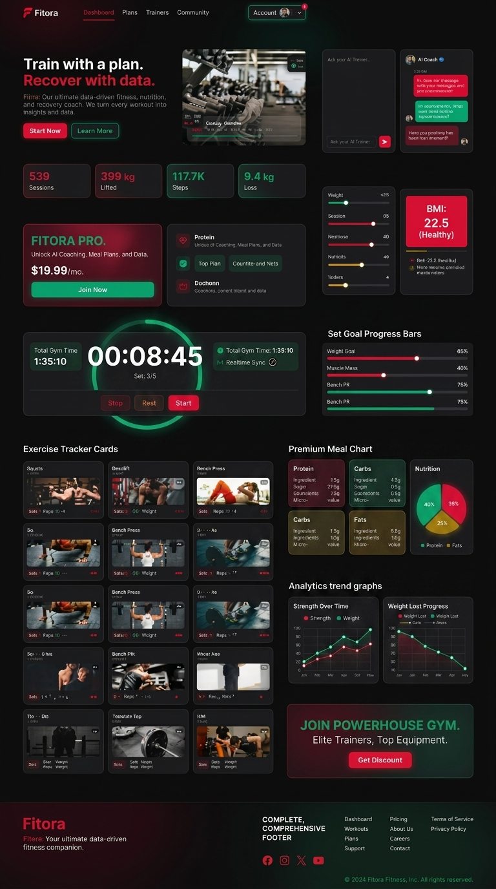

# Fitora - AI-Powered Realtime Fitness Planner Platform

[](https://nextjs.org/)
[](https://expressjs.com/)
[](https://www.typescriptlang.org/)
[](https://mongoosejs.com/)
[](https://better-auth.com/)
[](https://tailwindcss.com/)
[](https://fitora-fitness.vercel.app)

**Fitora** is a full-stack, real-time fitness planner platform designed for health enthusiasts and individuals committed to achieving peak physical fitness. Powered by Next.js 16, Node.js, Mongoose ODM, Better Auth, and Socket.IO bidirectional web-sockets, Fitora provides seamless real-time workout tracking, AI-assisted training, and nutrition analytics.

🌐 **Live Demo Application**: [https://fitora-fitness.vercel.app](https://fitora-fitness.vercel.app)

---

## 🎨 Base UI Design & Layout Reference



---

## 🌟 Core Modules & Standalone Pages

- 🏋️ **Real-Time Gym Timer HUD (`/stopwatch`)**: Fullscreen distraction-free rest timer with exercise selector chips, quick rest add buttons (+30s, +60s), and automated Web Audio alerts.
- 🤖 **AI Coach Studio (`/dashboard/user/ai-coach`)**: Full-screen AI Studio layout featuring quick prompt chips ("Chest & Push Split", "Calculate Protein Macros", "DOMS Recovery", "Progressive Overload"), 1-click clipboard export, and real-time typing animation.
- 📊 **Metric & BMI Calculator (`/calculator`)**: Dynamic height/weight sliders with real-time BMI, BMR, and TDEE macro gauge visualizations.
- 🥗 **Nutrition & Diet Tracker (`/dashboard/user/nutrition`)**: Dynamic 2,400 kcal progress bar, category filterable meal cards (Breakfast, Lunch, Dinner, Snacks).
- 🏆 **User Profile & Milestones (`/profile`)**: Fitness streak counter (🔥 12-day streak), earned achievement badges ("100k KG Lifted", "Streak Champion"), and completed goal history.
- 💎 **Membership & Pricing Plans (`/plans`)**: 3-tier membership model (Free, Pro $19.99/mo, VIP Elite $39.99/mo) with monthly/annual 20% discount billing toggle, comparison table, and FAQ accordion.
- 🔐 **Authentication Flow (`/login` & `/register`)**: Glassmorphism UI with form validation, toast feedback, and Better Auth integration.

---

## 🛠️ Tech Stack

### Frontend (`/client`)
- **Framework**: Next.js 16 (App Router / Turbopack)
- **Language**: TypeScript
- **Styling**: Tailwind CSS v4, HeroUI, Framer Motion
- **Icons**: Lucide React
- **Auth & Utilities**: Better Auth, React Fast Marquee, React Hot Toast
- **Realtime**: Socket.IO Client

### Backend (`/server`)
- **Runtime**: Node.js & Express.js
- **Database**: MongoDB with Mongoose ODM
- **Language**: TypeScript (`tsx` engine)
- **Realtime**: Socket.IO Server
- **Security & Config**: CORS, Dotenv, JWT Authentication

---

## 📁 Repository Structure

```
Fitora/
├── client/                 # Next.js Frontend Application
│   ├── public/             # Static Assets & Design Reference
│   ├── src/
│   │   ├── app/            # Next.js App Router standalone pages
│   │   │   ├── calculator/ # BMI & Macro Calculator Page
│   │   │   ├── dashboard/  # User Dashboard & AI Coach Studio
│   │   │   ├── login/      # Glassmorphism Login Page
│   │   │   ├── plans/      # Membership Pricing Plans Page
│   │   │   ├── profile/    # User Profile & Achievements Page
│   │   │   ├── register/   # User Registration Page
│   │   │   └── stopwatch/  # Fullscreen Gym Timer HUD
│   │   ├── components/     # Reusable UI Components & Home Sections
│   │   ├── context/        # React Context & Socket Providers
│   │   ├── hooks/          # Custom Hooks (useSocket, useAuth, etc.)
│   │   ├── lib/            # Auth Client & Utility Libraries
│   │   └── types/          # Frontend TypeScript Interfaces
│   ├── .env.example        # Environment Variables Template
│   └── package.json
│
├── server/                 # Express.js Backend API & Socket Server
│   ├── src/
│   │   ├── config/         # Database & Server Config
│   │   ├── controllers/    # Route Controllers
│   │   ├── middlewares/    # Auth, Error & Validation Middlewares
│   │   ├── models/         # Mongoose Schemas & ODM Models
│   │   ├── routes/         # Express API Routes
│   │   ├── services/       # Business Logic Services
│   │   └── sockets/        # Socket.IO Event Handlers
│   ├── .env.example        # Environment Variables Template
│   └── package.json
│
├── docs/                   # Documentation Assets & Design Specs
├── package.json            # Root Workspace Script Runner (concurrently)
├── .gitignore              # Root Git Ignore Policy
└── README.md               # Project Documentation
```

---

## 🚀 Getting Started

### Prerequisites
- **Node.js**: v18.x or higher
- **NPM**: v9.x or higher
- **MongoDB**: Local MongoDB server or MongoDB Atlas URI

### Installation & Setup

1. **Clone the Repository**:
   ```bash
   git clone https://github.com/Developer-Moy/Fitora.git
   cd Fitora
   ```

2. **Configure Environment Variables**:
   - Copy `.env.example` in `client/` to `client/.env`
   - Copy `.env.example` in `server/` to `server/.env`

3. **Install Dependencies**:
   ```bash
   # Install root runner
   npm install

   # Install client dependencies
   cd client && npm install

   # Install server dependencies
   cd ../server && npm install
   ```

4. **Run Development Mode**:
   From the root `Fitora/` directory:
   ```bash
   npm run dev
   ```
   - **Frontend App**: `http://localhost:3000`
   - **Backend API & Socket Server**: `http://localhost:5000`

---

## 📄 License
This project is licensed under the MIT License.
