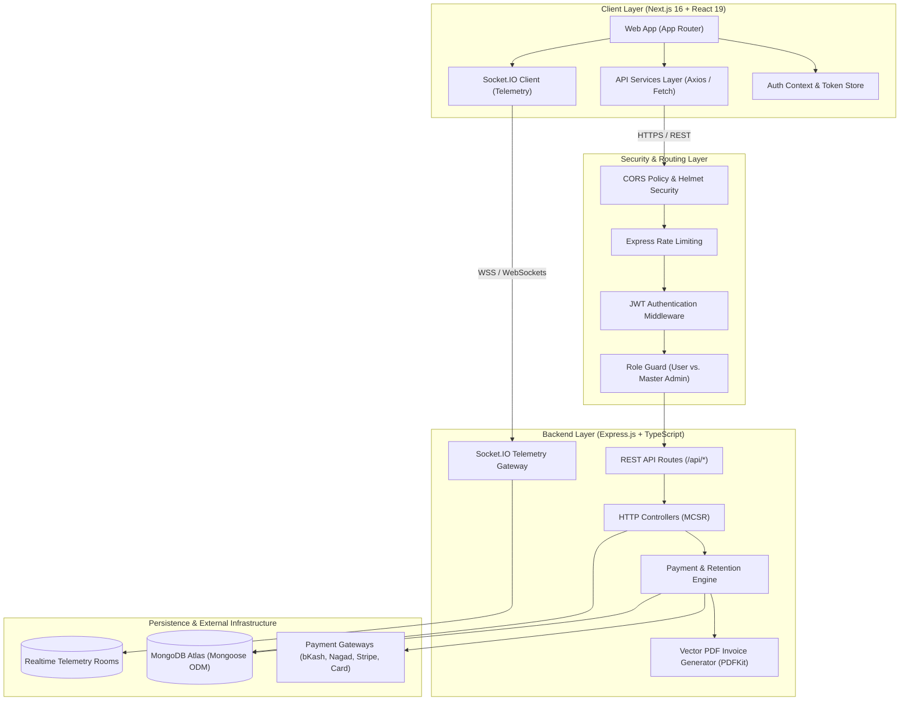
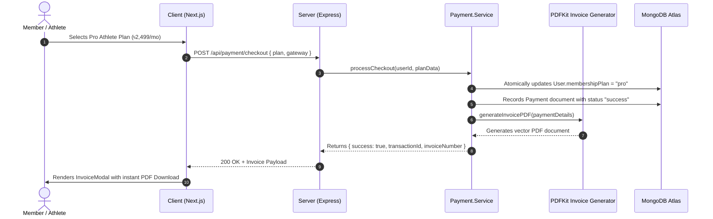

# 🏋️‍♂️ FITORA — Full-Stack System Architecture & Technical Specification

> **Platform Overview**: **Fitora** is Bangladesh's premier AI-powered gym and fitness ecosystem connecting athletes, trainers, and administrators across all 64 districts. Engineered with a **Pure Monochromatic Black & White (`#000000` / `#FFFFFF`) High-Contrast Luxury Aesthetic**, the platform combines live workout telemetry, digital QR turnstile check-ins, multi-gateway payments, and executive administrative governance into a unified full-stack web ecosystem.

---

## 📑 Table of Contents

- [1. Executive Architectural Overview](#1-executive-architectural-overview)
- [2. High-Level System Architecture Diagram](#2-high-level-system-architecture-diagram)
- [3. Frontend Architecture & Domain Decomposition](#3-frontend-architecture--domain-decomposition)
- [4. Backend Architecture & MCSR Pattern](#4-backend-architecture--mcsr-pattern)
- [5. Role-Based Access Control (RBAC) & Security Architecture](#5-role-based-access-control-rbac--security-architecture)
- [6. Database Models & Schema Specifications](#6-database-models--schema-specifications)
- [7. Subscription, Payment & Retention Engine](#7-subscription-payment--retention-engine)
- [8. Real-Time Telemetry & Socket.IO Services](#8-real-time-telemetry--socketio-services)
- [9. Complete Product Showcase & Module Reference](#9-complete-product-showcase--module-reference)
- [10. Production Deployment & Operational Architecture](#10-production-deployment--operational-architecture)
- [11. 100% Dynamic MongoDB Data Engine & Reliability Standards](#11-100-dynamic-mongodb-data-engine--reliability-standards)

---

## 1. Executive Architectural Overview

Fitora is structured as an **Enterprise Full-Stack Monorepo** separating the Next.js frontend client from the Express.js API backend while maintaining unified TypeScript types and strict domain boundaries.

```
Fitora/
├── client/                     # Next.js 16 (Turbopack) + React 19 Frontend Web Application
├── server/                     # Node.js + Express 4/5 + MongoDB Atlas Microservice
├── docs/                       # Architectural specifications & ecosystem visual showcases
│   ├── fitora.png              # 7-screen ultra-luxury ecosystem showcase graphic
│   └── project_architecture.md # Complete technical blueprint (this file)
└── README.md                   # Monorepo root entrypoint & developer overview
```

### Core Architectural Principles

1. **Separation of Concerns (SoC)**: Business logic, database interactions, HTTP controllers, and UI presentation are strictly partitioned.
2. **Domain-Driven Directory Structure**: Frontend components and backend controllers are grouped by business domain (`calculator`, `time`, `profile`, `exercises`, `invoice`, `dashboard`) rather than flat monolithic folders.
3. **Resilient Data Fetching**: Client services attempt real backend API calls first, falling back gracefully to typed defaults with user feedback if the backend is temporarily unavailable.
4. **Single Source of Truth**: State transitions (e.g., membership upgrade, QR turnstile check-in) are validated and executed server-side with atomic MongoDB updates.
5. **Brutalist Luxury Design System**: 100% monochromatic styling without colored accents, utilizing contrast ratios compliant with WCAG AAA standards.

---

## 2. High-Level System Architecture Diagram



---

## 3. Frontend Architecture & Domain Decomposition

The frontend is built using **Next.js 16 with React 19, TypeScript 5.5, and Tailwind CSS v4**. It utilizes the Next.js **App Router** for layout composition, code-splitting, and server-client boundary management.

### 3.1 Application Route Map

| Route              | Page Component                     | Rendering               | Access Level    | Description                                                            |
| ------------------ | ---------------------------------- | ----------------------- | --------------- | ---------------------------------------------------------------------- |
| `/`                | `src/app/page.tsx`                 | SSR / SSG               | Public          | Hero banner, live member counters, membership tiers, contact form      |
| `/profile`         | `src/app/profile/page.tsx`         | Client (`"use client"`) | Authenticated   | Member Hub, QR gym pass, 365-day attendance heatmap, hydration gauge   |
| `/profile/edit`    | `src/app/profile/edit/page.tsx`    | Client (`"use client"`) | Authenticated   | Personal info, avatar upload, biometrics, fitness targets              |
| `/calculator`      | `src/app/calculator/page.tsx`      | Client (`"use client"`) | Public / Member | Interactive BMI slider, daily calorie & macronutrient target planner   |
| `/stopwatch`       | `src/app/stopwatch/page.tsx`       | Client (`"use client"`) | Public / Member | Live circular HUD workout timer, voice countdown, rest interval chips  |
| `/exercises`       | `src/app/exercises/page.tsx`       | Client (`"use client"`) | Public / Member | 100+ exercise catalog, category muscle chips, video coaching tutorials |
| `/meals`           | `src/app/meals/page.tsx`           | Client (`"use client"`) | Public / Member | Healthy nutrition meals, macro breakdown (P/C/F), calorie filters      |
| `/dashboard`       | `src/app/dashboard/page.tsx`       | Client (`"use client"`) | Admin Only      | Executive KPI telemetry, monthly revenue chart, live attendance logs   |
| `/login`           | `src/app/login/page.tsx`           | Client (`"use client"`) | Public (Guest)  | JWT email/password login, demo accounts, trial redirect                |
| `/register`        | `src/app/register/page.tsx`        | Client (`"use client"`) | Public (Guest)  | Account creation, auto-initialized 3-day Pro trial                     |
| `/payment/success` | `src/app/payment/success/page.tsx` | Client (`"use client"`) | Authenticated   | Checkout confirmation, invoice preview, PDF download trigger           |
| `/payment/failed`  | `src/app/payment/failed/page.tsx`  | Client (`"use client"`) | Authenticated   | Graceful failure recovery, retry with alternate gateway                |

### 3.2 Domain-Driven Component Tree

```
client/src/components/
├── calculator/                     # Domain: Metric & Nutrition Calculations
│   ├── BMICalculator.tsx           # Dynamic height/weight sliders & color-gauge
│   ├── DailyMealPlan.tsx           # Daily nutrition goal planner
│   ├── MealChart.tsx               # Macro distribution donut chart
│   └── NutritionTracker.tsx        # Daily water & calorie tracker
├── time/                           # Domain: Workout Timing & Rest Interval HUD
│   ├── GymTimer.tsx                # Circular SVG HUD stopwatch & voice cues
│   └── TimeTracker.tsx             # Set intervals & workout duration logs
├── profile/                        # Domain: Member Profile & Telemetry
│   └── WorkoutHeatmap.tsx          # 365-day GitHub-style gym attendance matrix
├── exercises/                      # Domain: Exercise Video & Movement Studio
│   └── ExerciseTracker.tsx         # Muscle chips, video player modal, PR log
├── invoice/                        # Domain: Billing, Subscriptions & Invoicing
│   └── InvoiceModal.tsx            # Digital receipt viewer & PDF download modal
├── dashboard/                      # Domain: Executive Admin Telemetry
│   ├── AdminDashboard.tsx          # Master admin command center
│   ├── StatCard.tsx                # Reusable luxury KPI metric cards
│   ├── ActivityHeatmap.tsx         # Platform-wide member check-in heatmap
│   ├── WorkoutChart.tsx            # Monthly revenue & membership analytics
│   ├── RecentWorkouts.tsx          # Live gym turnstile telemetry stream
│   └── QuickActions.tsx            # Admin quick management controls
├── home/                           # Domain: Landing Page & Public Visual Identity
│   ├── HeroSection.tsx             # Athlete cutout, live stats ticker & SVG notch
│   ├── WhyChooseUs.tsx             # 64-branch highlights & facility features
│   ├── PricingSection.tsx          # 3-tier membership cards (Basic/Pro/VIP)
│   ├── TrainerCalloutBanner.tsx    # Consultation hotline callout
│   └── ContactInfoForm.tsx         # Nationwide branch locator & inquiry form
└── ui/                             # Shared atomic UI primitives & navigation
    ├── Navbar.tsx                  # Monochromatic desktop navigation bar
    ├── Footer.tsx                  # Global footer with 64-district directory
    ├── MobileDrawer.tsx            # Responsive touch-optimized mobile navigation
    └── NotificationsModal.tsx      # Real-time alert tray with unread counter
```

> **Clean Architecture Note**: Backward-compatible re-exports are maintained at root `client/src/components/*.ts` to guarantee that legacy import paths remain fully functional while new code utilizes domain paths.

---

## 4. Backend Architecture & MCSR Pattern

The Fitora backend follows the **Model-Controller-Service-Route (MCSR)** design pattern, isolating business operations into specialized testable layers.

```
server/src/
├── config/                         # Infrastructure & database connection setup
│   └── db.ts                       # MongoDB Atlas Mongoose connection & index bootstrap
├── controllers/                    # HTTP Request Validation & Response Serialization
│   ├── auth.controller.ts          # Auth, registration, 3-day trial assignment
│   ├── branch.controller.ts        # 64 branch directory & check-in turnstile logging
│   ├── dashboard.controller.ts     # Admin revenue, user growth & occupancy telemetry
│   ├── exercise.controller.ts      # Exercise movements, categories, muscle group filters
│   ├── master.controller.ts        # Superuser governance & system analytics
│   ├── meal.controller.ts          # Nutrition recipes & calorie/macro filters
│   ├── notification.controller.ts  # Notification dispatch & unread status
│   ├── payment.controller.ts       # Checkout, card retention & invoice endpoints
│   ├── stopwatch.controller.ts     # Stopwatch workout sessions & set telemetry
│   ├── user.controller.ts          # Member profiles, biometrics, saved cards
│   └── workout.controller.ts       # Workout logging & consistency tracking
├── services/                       # Business Logic Layer (Decoupled from HTTP)
│   └── payment.service.ts          # Multi-gateway logic, card bonuses, PDF invoice generation
├── models/                         # Mongoose ODM Schema Definitions & TypeScript Interfaces
│   ├── Branch.model.ts             # 64 nationwide gym locations
│   ├── BranchCheckin.model.ts      # Real-time turnstile entry logs
│   ├── Exercise.model.ts           # Exercise movements & video tutorials
│   ├── Meal.model.ts               # Nutrition catalog & macro recipes
│   ├── Notification.model.ts       # Member alert notifications
│   ├── Payment.model.ts            # Payment ledger & invoice metadata
│   ├── StopwatchSession.model.ts   # Live HUD workout sessions
│   ├── User.model.ts               # User schema with RBAC, subscription & biometrics
│   └── Workout.model.ts            # Workout log & PR records
├── middlewares/                    # Request Interceptors & Security Filters
│   ├── auth.middleware.ts          # JWT bearer / cookie extraction & master admin bypass
│   └── premium.middleware.ts       # Pro / VIP tier gate with admin overrides
└── routes/                         # Central API Routing Table
    └── index.ts                    # Mounts all REST sub-routers under /api
```

---

## 5. Role-Based Access Control (RBAC) & Security Architecture

Fitora enforces multi-layered RBAC across both client UI routes and backend API endpoints.

```
+-------------------------------------------------------------------------------------------------+
| USER ROLE                    | PLATFORM PERMISSIONS & CAPABILITIES                              |
+------------------------------+------------------------------------------------------------------+
| 1. Guest (Unauthenticated)   | Public Landing, Pricing, BMI Calculator, Public Exercise Previews|
| 2. Free Member               | Member Hub, Basic Workout Tracking, Stopwatch HUD, Meal Catalog |
| 3. Pro / VIP Athlete         | Digital QR Pass, 365-day Heatmap, Full Video Studio, AI Macros  |
| 4. Admin / Master Admin      | Complete Telemetry Portal, Financial KPI Cards, Check-in Audits  |
+-------------------------------------------------------------------------------------------------+
```

### 5.1 Access Control Matrix

| Feature / Route                              |        Guest         |      Free Member       |    Pro / VIP Member     |       Master Admin       |
| -------------------------------------------- | :------------------: | :--------------------: | :---------------------: | :----------------------: |
| **Homepage (`/`)**                           |      ✅ Allowed      |       ✅ Allowed       |       ✅ Allowed        |        ✅ Allowed        |
| **Login / Register (`/login`, `/register`)** |      ✅ Allowed      | 🔄 Redirect `/profile` | 🔄 Redirect `/profile`  | 🔄 Redirect `/dashboard` |
| **Member Hub (`/profile`)**                  | 🔒 Redirect `/login` |   ✅ Allowed (Basic)   | ✅ Full (QR Pass + Pro) |   ✅ Full + Admin CTA    |
| **Interactive Calculator (`/calculator`)**   |      ✅ Allowed      |       ✅ Allowed       |    ✅ Allowed + Sync    |    ✅ Allowed + Sync     |
| **Gym Stopwatch HUD (`/stopwatch`)**         |      ✅ Allowed      |       ✅ Allowed       | ✅ Allowed + Cloud Sync | ✅ Allowed + Cloud Sync  |
| **Exercise Library (`/exercises`)**          |      ✅ Preview      |       ✅ Allowed       |  ✅ Full Video Access   |   ✅ Full + Management   |
| **Nutrition Catalog (`/meals`)**             |      ✅ Preview      |       ✅ Allowed       | ✅ Full Macro Tracking  |   ✅ Full + Management   |
| **Admin Command Center (`/dashboard`)**      |    🚫 403 / Login    |    🚫 403 Forbidden    |    🚫 403 Forbidden     |   ✅ Exclusive Access    |

### 5.2 Master Admin Schema-Enforced Superuser

To prevent accidental lockout and enforce strict governance, the server includes an initialization bootstrap in `server/src/index.ts`:

- **`ensureMasterAdmin()`**: On server launch, checks for the presence of the system master administrator (`admin@fitora.com` / `master@fitora.com`).
- **Immutability Invariant**: The Master Admin role cannot be demoted or deleted via standard user management APIs.
- **Superuser Token Extraction**: Master Admin tokens bypass routine subscription checks and gain direct access to aggregate revenue metrics across all 64 districts.

---

## 6. Database Models & Schema Specifications

### 6.1 User Model (`User.model.ts`)

```typescript
interface IUser extends Document {
  name: string;
  email: string;
  passwordHash: string;
  role: "user" | "admin";
  isMasterAdmin?: boolean;
  membershipPlan: "free" | "basic" | "pro" | "vip";
  subscriptionStatus: "active" | "canceled" | "expired" | "trialing";
  trialEndsAt?: Date;
  subscriptionExpiresAt?: Date;
  district: string; // One of Bangladesh's 64 districts
  homeBranch?: mongoose.Types.ObjectId;
  biometrics?: {
    heightCm: number;
    weightKg: number;
    targetWeightKg?: number;
    dailyWaterTargetLiters?: number;
    bmi?: number;
  };
  savedCards?: Array<{
    last4: string;
    brand: string;
    expiryMonth: number;
    expiryYear: number;
    retentionBonusAwarded: boolean;
  }>;
  consistencyStreak: number;
  attendanceHistory: Array<{
    date: string; // YYYY-MM-DD
    checkinTime: Date;
    branchId: mongoose.Types.ObjectId;
  }>;
  createdAt: Date;
  updatedAt: Date;
}
```

### 6.2 Payment Ledger (`Payment.model.ts`)

```typescript
interface IPayment extends Document {
  user: mongoose.Types.ObjectId;
  transactionId: string;
  gateway: "bkash" | "nagad" | "rocket" | "card" | "stripe";
  amount: number; // In BDT
  currency: "BDT" | "USD";
  plan: "basic" | "pro" | "vip";
  billingCycle: "monthly" | "yearly";
  status: "pending" | "success" | "failed" | "refunded";
  invoiceNumber: string;
  invoicePdfPath?: string;
  metadata?: Record<string, any>;
  createdAt: Date;
}
```

### 6.3 Exercise Movement (`Exercise.model.ts`)

```typescript
interface IExercise extends Document {
  name: string;
  slug: string;
  targetMuscle:
    | "chest"
    | "back"
    | "legs"
    | "arms"
    | "shoulders"
    | "core"
    | "glutes"
    | "cardio";
  category:
    | "strength"
    | "hypertrophy"
    | "endurance"
    | "mobility"
    | "functional";
  difficulty: "beginner" | "intermediate" | "advanced";
  equipment: "barbell" | "dumbbell" | "cable" | "machine" | "bodyweight";
  videoUrl: string;
  thumbnailUrl?: string;
  instructions: string[];
  isProOnly: boolean;
}
```

---

## 7. Subscription, Payment & Retention Engine

Fitora includes a complete financial and customer retention engine managed by `server/src/services/payment.service.ts`:



### Key Retention Innovations

1. **3-Day Free Pro Trial**: Automatically initialized upon member registration with a real-time countdown badge (`trialExpiresAt = Date.now() + 3 days`).
2. **Saved Card & 2 Bonus Months Retention Engine**: Purchasing a monthly membership with a saved card automatically awards **90 days total access (1 month purchase + 2 bonus months FREE)** with masked card metadata securely saved to MongoDB.
3. **Multi-Gateway Payment Switch**: Native checkout support for Bangladesh's primary payment channels (**bKash, Nagad, local Visa/Mastercard**) plus international card processing via Stripe.
4. **Portal-Mounted Invoice Engine & Vector PDF Export**: React Portal architecture mounting directly to `document.body` at `z-[99999]`, single-page compact desktop layout, dual-layer print CSS isolation, and crisp client-side vector PDF generation (`jspdf`) containing athlete contact, branch, TRX ID, and legal verification seal.

---

## 8. Real-Time Telemetry & Socket.IO Services

Fitora utilizes WebSockets (`Socket.IO 4.7`) for live gym infrastructure telemetry:

- **Turnstile Telemetry**: Whenever an athlete scans their QR pass at a physical gym turnstile, a `branch:checkin` event is broadcast to the Admin Dashboard.
- **Occupancy Gauges**: Real-time member occupancy is calculated dynamically per branch (e.g., Gulshan-2 Flagship branch active capacity).
- **Workout Timer Sync**: Multi-device HUD stopwatch state sync allowing an athlete to track their rest interval on mobile while viewing exercise tutorials on tablet.

---

## 9. Complete Product Showcase & Module Reference

The entire Fitora ecosystem across all 7 core modules is consolidated into the high-resolution composite graphic at [docs/fitora.png](file:///mnt/File/Work/Fitora/docs/fitora.png):

```
+---------------------------------------------------------------------------------------------------------+
|                                    FITORA GYM & FITNESS PLATFORM                                        |
|                             COMPLETE FULL-STACK ECOSYSTEM SHOWCASE                                      |
|            7 Live Production Screens • Next.js 15 • React 19 • Express 5 • MongoDB • Tailwind CSS       |
+----------------------------------------------------+----------------------------------------------------+
| 01. HOMEPAGE & HERO SECTION                        | 02. MEMBER HUB & QR PASS                           |
| Path: /                                            | Path: /profile                                     |
| • Bold athlete hero visual & SVG notch             | • Dynamic Gym Pass QR for turnstiles               |
| • Real-time stats ticker (105+ Trainers, 970+ Mbr) | • 365-Day attendance activity heatmap              |
| • Membership tier cards & package selector         | • Daily hydration target gauge (2.9 L/day)         |
+---------------------------------+------------------+---------------+------------------------------------+
| 03. EXERCISE & PR STUDIO        | 04. GYM STOPWATCH HUD            | 05. METRIC & MACRO CALCULATOR      |
| Path: /exercises                | Path: /stopwatch                 | Path: /calculator                  |
| • 100+ movements with muscle chips| • Circular SVG timer HUD         | • Interactive height/weight sliders|
| • Chest, Back, Legs, Arms filters| • Rest interval chips (15s, 60s) | • Real-time BMI color gauge (22.5) |
| • HD video coaching tutorials   | • Live audio voice cues          | • Daily calorie & macro targets    |
+---------------------------------+------------------+---------------+------------------------------------+
| 06. HEALTHY NUTRITION CATALOG                      | 07. ADMIN CONTROL & TELEMETRY                      |
| Path: /meals                                       | Path: /dashboard                                   |
| • Macro breakdown per meal (Protein, Carbs, Fat)   | • Executive KPI telemetry (৳84,50,000 revenue)     |
| • Calorie filters & diet category chips            | • Monthly revenue progression bar chart            |
| • High-protein recipe preparation cards            | • Live branch turnstile occupancy telemetry        |
+----------------------------------------------------+----------------------------------------------------+
| FITORA ECOSYSTEM SHOWCASE — PRODUCTION-READY FULL-STACK ARCHITECTURE • 100% REAL APPLICATION TELEMETRY  |
+---------------------------------------------------------------------------------------------------------+
```

---

## 10. Production Deployment & Operational Architecture

```
Internet Requests
       │
       ▼
┌──────────────┐          ┌──────────────────────┐
│ Vercel Edge  │ ───────> │ Next.js 16 Client    │ (App Router, Turbopack, SSR/SSG)
└──────────────┘          └──────────┬───────────┘
                                     │ HTTPS / WSS
                                     ▼
┌──────────────┐          ┌──────────────────────┐
│ Render / VPS │ ───────> │ Node.js Express API  │ (TypeScript, Port 5000, PM2/Docker)
└──────────────┘          └──────────┬───────────┘
                                     │ Mongoose TLS
                                     ▼
┌──────────────┐          ┌──────────────────────┐
│ MongoDB Atlas│ <─────── │ Sharded Replica Set  │ (Primary / Secondary Clusters)
└──────────────┘          └──────────────────────┘
```

### Health Check & Monitoring Endpoints

- **Server Health Ping**: `GET /api/health` — Returns status `200 OK`, server timestamp, and database connectivity state.
- **Database Status**: Verified automatically during boot by `server/src/config/db.ts`.
- **Zero-Downtime Hot Reloading**: Configured via Turbopack (`next dev --turbopack`) on client and `tsx watch` on server.

---

## 11. 100% Dynamic MongoDB Data Engine & Reliability Standards

Fitora enforces a strict architectural standard: **zero client-side mock data fallbacks** and **100% server-authoritative persistence**:

### 11.1 Mongoose Model Namespace Isolation

To prevent fatal `OverwriteModelError` crashes across sub-modules, all Mongoose models are strictly named and defensively initialized:

- `MealChart.model.ts`: Explicitly compiled as `MealChart` avoiding collision with `MealPlan.model.ts`.
- `User.model.ts`: Single Master Admin invariant enforced at schema pre-save hook.

### 11.2 MongoDB Query CastError Protection

All dynamic parameter queries check for valid ObjectId casting before executing compound lookups:

- `meal.controller.ts:getMealById`: Uses `mongoose.isValidObjectId(id) ? { $or: [{ id }, { _id: id }] } : { id }` to allow both slug lookups (`classic-beef-stir-fry`) and standard 24-character hexadecimal ObjectIds without throwing HTTP 500.

### 11.3 Goal Schema Normalization & Fallback Tolerance

- Normalizes case-insensitive input (`Bulking`, `Cutting`, `Recomp`, `Maintenance`) to satisfy strict Mongoose enum paths.
- Provides server-side defaults for BMR (1800), TDEE (2200), target calories (2200), and macro distribution (140P / 220C / 65F) when goals are created from partial dashboard payloads.

### 11.4 Zero-Mock Integrity Guarantee

- `searchService.ts`: Completely eradicated 140+ lines of offline fallback mock records. Empty or offline searches cleanly return zero results instead of fabricated athlete accounts.
- `dashboard/page.tsx`: Purged fabricated multi-million fallback revenue balances and hardcoded member counts. All metrics are derived from live MongoDB `$facet` aggregations.

---

<div align="center">

**FITORA FITNESS PLATFORM** • Designed & Developed by **DeveloperMoy**  
_Serving Athletes and Gym Networks Across Bangladesh • Gulshan-2, Dhaka 1212_

</div>
